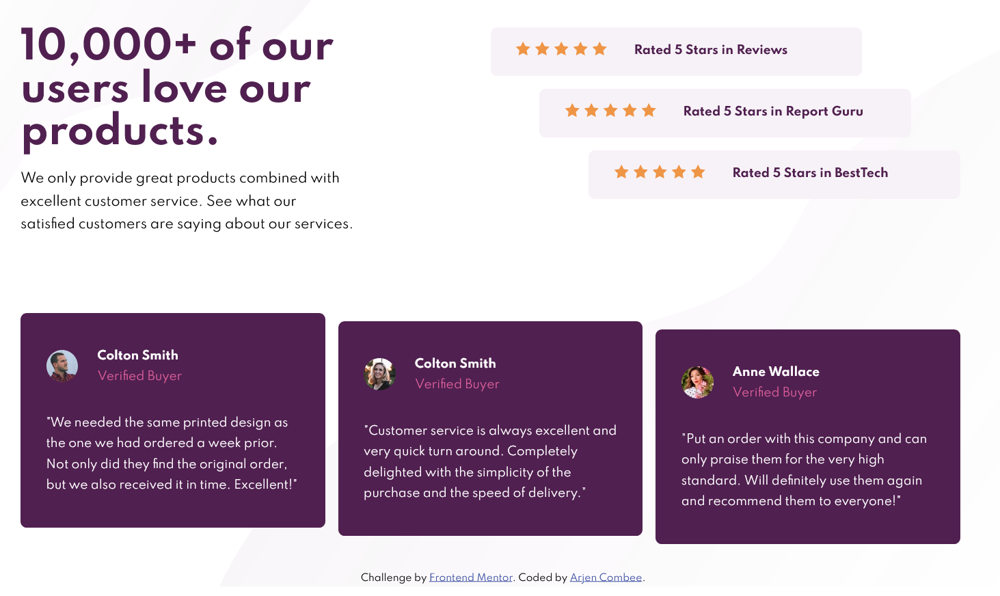

# Frontend Mentor - Social proof section solution

This is a solution to the [Social proof section challenge on Frontend Mentor](https://www.frontendmentor.io/challenges/social-proof-section-6e0qTv_bA). Frontend Mentor challenges help you improve your coding skills by building realistic projects.

## Table of contents

- [Frontend Mentor - Social proof section solution](#frontend-mentor---social-proof-section-solution)
  - [Table of contents](#table-of-contents)
  - [Overview](#overview)
    - [The challenge](#the-challenge)
    - [Screenshot](#screenshot)
    - [Links](#links)
  - [My process](#my-process)
    - [Built with](#built-with)
    - [What I learned](#what-i-learned)
    - [Continued development](#continued-development)
  - [Author](#author)

## Overview

### The challenge

Users should be able to:

- View the optimal layout for the section depending on their device's screen size

### Screenshot

### Links

- Live Site URL: [Github Pages](https://arjencombee.github.io/005_social-proof/)

## My process

### Built with

- Semantic HTML5 markup
- Mobile-first workflow
- CSS custom properties
- CSS Flexbox
- CSS Grid
- CSS Transition

### What I learned

In this project I used CSS grip with the area names. Seems a cool way to place content within the grid.

### Continued development

Working with background SVG's and the placement is somewhat easier, but still learning how to deal with correct image placement and customizing the CSS attribute's and declarations.

## Author

- Website - [Arjen Combee](https://arjencombee.nl)
- Frontend Mentor - [@ArjenCombee](https://www.frontendmentor.io/profile/arjencombee)
